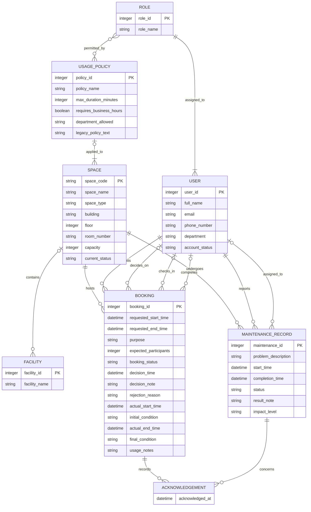

# Conceptual Database Design (ERD)
## 1. Conceptual Entity-Relationship Diagram
### Diagram 
Copy the code below and paste it into a live editor like Mermaid Live to view the diagram. The diagram has been updated to include the new entities and relationships required for Phase 2.



### Conceptual Data Dictionary

#### Entities and Attributes

*   **ROLE**
    *   `role_id` (PK) — int
    *   `role_name` — string
*   **USER**
    *   `user_id` (PK) — int
    *   `full_name` — string
    *   `email` — string
    *   `phone_number` — string
    *   `department` — string
    *   `account_status` — string
*   **SPACE**
    *   `space_code` (PK) — string
    *   `space_name` — string
    *   `space_type` — string
    *   `building` — string
    *   `floor` — int
    *   `room_number` — string
    *   `capacity` — int
    *   `current_status` — string
*   **FACILITY**
    *   `facility_id` (PK) — int
    *   `facility_name` — string
*   **BOOKING**
    *   `booking_id` (PK) — int
    *   `requested_start_time` — datetime
    *   `requested_end_time` — datetime
    *   `purpose` — string
    *   `expected_participants` — int
    *   `booking_status` — string
    *   `decision_time` — datetime
    *   `decision_note` — string
    *   `rejection_reason` — string
    *   `actual_start_time` — datetime
    *   `initial_condition` — string
    *   `actual_end_time` — datetime
    *   `final_condition` — string
    *   `usage_notes` — string
*   **MAINTENANCE_RECORD**
    *   `maintenance_id` (PK) — int
    *   `problem_description` — string
    *   `start_time` — datetime
    *   `completion_time` — datetime
    *   `status` — string
    *   `result_note` — string
    *   `impact_level` — string
*   **USAGE_POLICY**
    *   `policy_id` (PK) — int
    *   `policy_name` — string
    *   `max_duration_minutes` — int
    *   `requires_business_hours` — boolean
    *   `department_allowed` — string
    *   `legacy_policy_text` — nullable string containing the preserved Phase 1 free-text usage policy; it is retained for migration traceability and is not evaluated as an auto-approval condition
*   **ACKNOWLEDGEMENT**
    *   `acknowledged_at` — datetime

#### Relationship Summary

| Entity (Left) | Cardinality | Entity (Right) | Verb Phrase | Participation | Description |
|---|---|---|---|---|---|
| ROLE | 1 : N | USER | assigned_to | Role mandatory; User mandatory | A user must have exactly one role and a role must belong to at least one user. |
| USER | 1 : N | BOOKING | submits | User optional; Booking mandatory | Each booking must be submitted by exactly one requester; each user may submit zero or many bookings. |
| USER | 1 : N | BOOKING | decides_on | User optional; Booking optional | Each booking may be decided on by at most one staff member; each staff member may decide on zero or many bookings. |
| USER | 1 : N | BOOKING | checks_in | User optional; Booking optional | Each booking may be checked in by at most one staff member; each staff member may check in zero or many bookings. |
| USER | 1 : N | BOOKING | completes | User optional; Booking optional | Each booking may be completed by at most one staff member; each staff member may complete zero or many bookings. |
| SPACE | 1 : N | BOOKING | hosts | Space optional; Booking mandatory | Each booking must reserve exactly one space; each space may host zero or many bookings over time. |
| USER | 1 : N | MAINTENANCE_RECORD | reports | User optional; MR mandatory | Each maintenance record must have exactly one reporter; each user may report zero or many records. |
| USER | 1 : N | MAINTENANCE_RECORD | assigned_to | User optional; MR optional | Each maintenance record may be assigned to at most one staff member; each staff member may be assigned zero or many records. |
| SPACE | 1 : N | MAINTENANCE_RECORD | undergoes | Space optional; MR mandatory | Each maintenance record must concern exactly one space; each space may undergo zero or many maintenance records. |
| SPACE | 1 : N | FACILITY | contains | Space optional; Facility optional | Each space may contain zero or many facilities; each facility may exist in at most one space. |
| USAGE_POLICY | 1 : N | SPACE | applied_to | Policy optional; Space mandatory | A space can have 0 or 1 usage policy, and a specific usage policy must be applied to at least one space. |
| ROLE | M : N | USAGE_POLICY | permitted_by | Role optional; Policy optional | A usage policy might only allow some specific roles or might not, and a role does not have to be listed in a usage policy. |
| BOOKING | 1 : N | ACKNOWLEDGEMENT | records | Booking optional; Ack mandatory | A booking may have zero or many acknowledgements; each acknowledgement belongs to exactly one booking. |
| MAINTENANCE_RECORD | 1 : N | ACKNOWLEDGEMENT | concerns | MR optional; Ack mandatory | A maintenance record may be referenced by zero or many acknowledgements; each acknowledgement concerns exactly one maintenance record. |

---

## 2. Logical Database Design (Relational Schema)
### Diagram
Copy the code below and paste it into [dbdiagram.io](https://dbdiagram.io/)  to view the updated schema.
```dbml
// --- Tables ---

Table ROLE {
  role_id integer [pk, increment]
  role_name varchar(50) [not null, unique]
}

Table USER {
  user_id integer [pk, increment]
  full_name varchar(255) [not null]
  email varchar(255) [not null, unique]
  phone_number varchar(20) [not null, unique]
  role_id integer [not null]
  department varchar(255) [not null]
  account_status varchar(50) [not null, default: 'active']
}

Table USAGE_POLICY {
  policy_id integer [pk, increment]
  policy_name varchar(255) [not null]
  max_duration_minutes integer
  requires_business_hours boolean
  department_allowed varchar(255)
  legacy_policy_text text
}

Table ROLE_USAGE_POLICY {
  role_id integer [not null]
  policy_id integer [not null]
  
  Indexes {
    (role_id, policy_id) [pk, name: 'pk_role_usage_policy']
  }
}

Table SPACE {
  space_code varchar(50) [pk]
  space_name varchar(255) [not null]
  space_type varchar(50) [not null]
  building varchar(255) [not null]
  floor integer [not null]
  room_number varchar(50) [not null]
  capacity integer [not null]
  current_status varchar(50) [not null, default: 'available']
  policy_id integer 

  Indexes {
    (building, floor, room_number) [unique, name: 'uq_space_location']
  }
}

Table FACILITY {
  facility_id integer [pk, increment]
  facility_name varchar(255) [not null]
  space_code varchar(50)
}

Table BOOKING {
  booking_id integer [pk, increment]
  requester_id integer [not null]
  space_code varchar(50) [not null]
  requested_start_time datetime [not null]
  requested_end_time datetime [not null]
  purpose varchar(50) [not null]
  expected_participants integer [not null]
  booking_status varchar(50) [not null, default: 'pending']
  decision_staff_id integer
  decision_time datetime
  decision_note text
  rejection_reason text
  check_in_staff_id integer
  actual_start_time datetime
  initial_condition text
  completion_staff_id integer
  actual_end_time datetime
  final_condition text
  usage_notes text
}

Table MAINTENANCE_RECORD {
  maintenance_id integer [pk, increment]
  space_code varchar(50) [not null]
  reporter_id integer [not null]
  assigned_staff_id integer
  problem_description text [not null]
  start_time datetime [not null]
  completion_time datetime
  status varchar(50) [not null, default: 'reported']
  result_note text
  impact_level varchar(50)
}

Table ACKNOWLEDGEMENT {
  booking_id integer [not null]
  maintenance_record_id integer [not null]
  acknowledged_at datetime
  
  Indexes {
    (booking_id, maintenance_record_id) [pk, name: 'pk_acknowledgement']
  }
}

// --- Relationships ---

// USER referencing ROLE
Ref: USER.role_id > ROLE.role_id

// SPACE referencing USAGE_POLICY
Ref: SPACE.policy_id > USAGE_POLICY.policy_id

// ROLE_USAGE_POLICY junction table (M:N between ROLE and USAGE_POLICY)
Ref: ROLE_USAGE_POLICY.role_id > ROLE.role_id [delete: cascade]
Ref: ROLE_USAGE_POLICY.policy_id > USAGE_POLICY.policy_id [delete: cascade]

// FACILITY referencing SPACE (1:N containment)
Ref: FACILITY.space_code > SPACE.space_code [delete: cascade]

// BOOKING referencing SPACE
Ref: BOOKING.space_code > SPACE.space_code

// BOOKING referencing USER (multi-role)
Ref: BOOKING.requester_id > USER.user_id
Ref: BOOKING.decision_staff_id > USER.user_id
Ref: BOOKING.check_in_staff_id > USER.user_id
Ref: BOOKING.completion_staff_id > USER.user_id

// MAINTENANCE_RECORD referencing SPACE
Ref: MAINTENANCE_RECORD.space_code > SPACE.space_code

// MAINTENANCE_RECORD referencing USER (multi-role)
Ref: MAINTENANCE_RECORD.reporter_id > USER.user_id
Ref: MAINTENANCE_RECORD.assigned_staff_id > USER.user_id

// ACKNOWLEDGEMENT belongs to one BOOKING (N:1 relation)
Ref: ACKNOWLEDGEMENT.booking_id > BOOKING.booking_id [delete: cascade]

// ACKNOWLEDGEMENT concerns one MAINTENANCE_RECORD (N:1 relation)
Ref: ACKNOWLEDGEMENT.maintenance_record_id > MAINTENANCE_RECORD.maintenance_id [delete: cascade]
```

### Business Integrity Constraints (T-SQL Domain CHECKs)
*Note: As Microsoft SQL Server (T-SQL) does not natively support the `ENUM` data type, categorical domains and scalar boundaries are explicitly enforced via single-row table `CHECK` constraints.*

**USER Domain Checks:**
* *(Note: Constraint Role was removed because now role is an entity.)*

**BOOKING Domain Checks:**
* **`chk_booking_decision_fields`**: `CHECK (([booking_status] <> 'rejected' OR ([decision_staff_id] IS NOT NULL AND [decision_time] IS NOT NULL AND [decision_note] IS NOT NULL)) AND ([booking_status] <> 'approved' OR [decision_time] IS NOT NULL))`
  *(Note: A rejected booking requires the deciding staff member, decision time, and decision note. Every approved booking requires a decision time. For an auto-approved booking, `decision_staff_id` may be NULL because the system made the decision.)*
