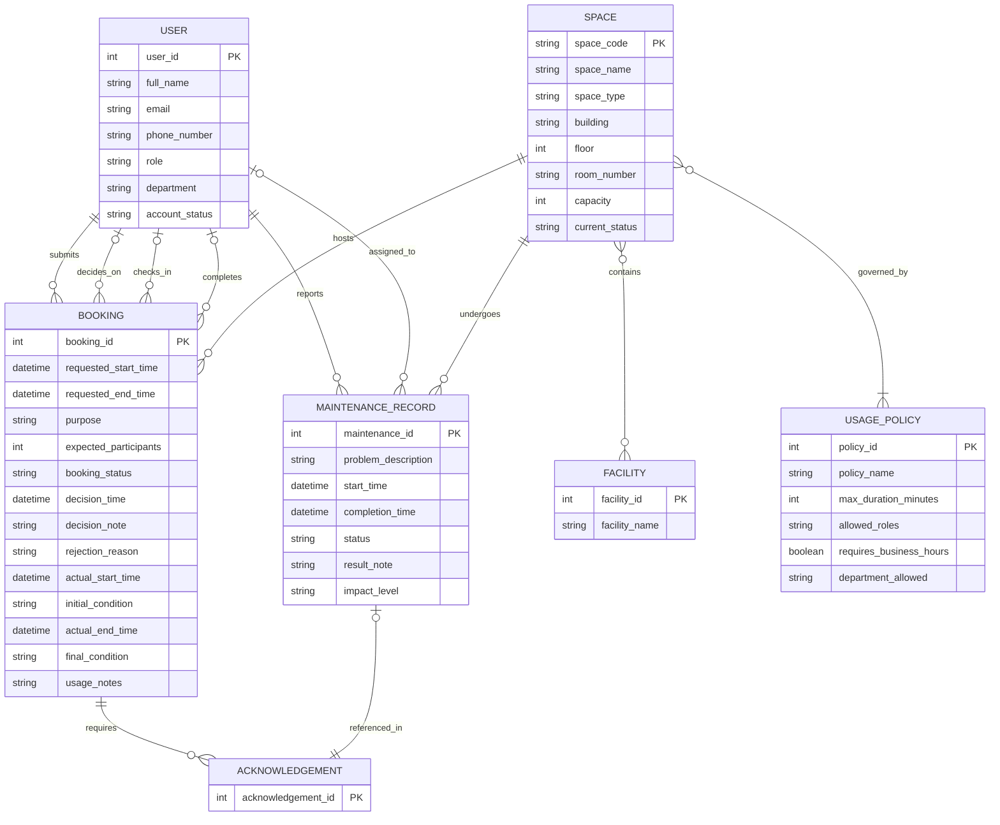

# Conceptual Database Design (ERD)
## 1. Conceptual Entity-Relationship Diagram
Copy the code below and paste it into a live editor like Mermaid Live to view the diagram. The diagram has been updated to include the new entities and relationships required for Phase 2.

